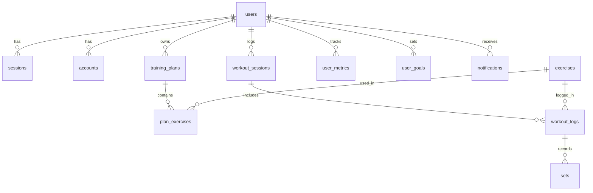
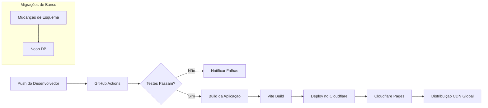

# FitTracker Pro - Documento de Requisitos de Produto (PRD)

## 📋 Informações do Documento

| Campo | Valor |
|-------|-------|
| **Nome do Projeto** | FitTracker Pro |
| **Versão** | 1.0.0 |
| **Status** | Em Desenvolvimento |
| **Stack de Tecnologias** | React + TypeScript + Vite + Neon PostgreSQL + Cloudflare |
| **Plataforma** | Web (Pronto para PWA) |
| **Idioma Primário** | Português (Brasil) |

---

## 🎯 Resumo Executivo

FitTracker Pro é uma aplicação abrangente de acompanhamento de fitness que permite aos usuários registrar treinos, acompanhar progresso, criar planos de treinamento e monitorar sua jornada fitness. A aplicação apresenta uma interface moderna com modo escuro/claro, análises em tempo real e uma biblioteca de exercícios com instruções detalhadas.

---

## 🏗️ Visão Geral da Arquitetura

### Arquitetura do Sistema

```
┌─────────────────────────────────────────────────────────────────┐
│                        Camada Frontend                           │
│  ┌─────────────┐  ┌─────────────┐  ┌─────────────┐             │
│  │   Páginas   │  │ Componentes │  │   Hooks     │             │
│  │   (React)   │  │   (TSX)     │  │  Custom     │             │
│  └─────────────┘  └─────────────┘  └─────────────┘             │
│           │               │               │                     │
│           └───────────────┴───────────────┘                     │
│                           │                                     │
│  ┌───────────────────────────────────────────────────────────┐ │
│  │              Gerenciamento de Estado (Zustand)             │ │
│  │  ┌──────────┐ ┌──────────┐ ┌──────────┐ ┌──────────┐      │ │
│  │  │  Auth    │ │ Workout  │ │   UI     │ │Exercise  │      │ │
│  │  │  Store   │ │  Store   │ │  Store   │ │  Store   │      │ │
│  │  └──────────┘ └──────────┘ └──────────┘ └──────────┘      │ │
│  └───────────────────────────────────────────────────────────┘ │
└─────────────────────────────────────────────────────────────────┘
                           │
                           ▼
┌─────────────────────────────────────────────────────────────────┐
│                    Camada API (Cloudflare)                      │
│  ┌──────────────────────┐  ┌──────────────────────┐            │
│  │   Funções de Auth    │  │    Funções de API    │            │
│  │  (Better Auth)       │  │   (Endpoints REST)   │            │
│  └──────────────────────┘  └──────────────────────┘            │
└─────────────────────────────────────────────────────────────────┘
                           │
                           ▼
┌─────────────────────────────────────────────────────────────────┐
│                  Camada de Dados (Neon PostgreSQL)              │
│  ┌──────────┐ ┌──────────┐ ┌──────────┐ ┌──────────┐           │
│  │  Usuários│ │Exercícios│ │  Treinos  │ │  Planos  │           │
│  │  Tables  │ │ Tables   │ │ Tables   │ │ Tables   │           │
│  └──────────┘ └──────────┘ └──────────┘ └──────────┘           │
└─────────────────────────────────────────────────────────────────┘
```

### Stack de Tecnologias

| Camada | Tecnologia | Propósito |
|-------|------------|-----------|
| **Frontend** | React 18 + TypeScript | Framework de interface |
| **Ferramenta de Build** | Vite 5 | Desenvolvimento rápido e bundling |
| **Roteamento** | React Router v6 | Roteamento no cliente |
| **Gerenciamento de Estado** | Zustand + Immer | Estado global com persistência |
| **Busca de Dados** | TanStack Query v5 | Estado do servidor e cache |
| **Banco de Dados** | Neon PostgreSQL | Banco de dados serverless |
| **Auth** | Better Auth | Framework de autenticação |
| **Hospedagem** | Cloudflare Pages | Deploy em edge |
| **Estilização** | Tailwind CSS | CSS utilitário |
| **Ícones** | Material Symbols | Biblioteca de ícones |
| **Monitoramento** | LogRocket | Rastreamento de erros e replay de sessão |

---

## 📦 Funcionalidades Principais

### 1. Autenticação e Perfis de Usuário

| Funcionalidade | Status | Prioridade | Descrição |
|----------------|--------|------------|-----------|
| Login Email/Senha | ✅ Concluído | P0 | Autenticação segura com verificação de email |
| Gerenciamento de Sessão | ✅ Concluído | P0 | Tokens JWT com armazenamento seguro |
| Recuperação de Senha | ✅ Concluído | P0 | Recuperação de senha via email |
| Gerenciamento de Perfil | ✅ Concluído | P1 | Atualizar nome, email, avatar |
| Verificação de Email | ✅ Concluído | P1 | Verificar endereço de email |
| Auth Social (Google) | 🔄 Planejado | P2 | Integração OAuth Google |
| Auth Social (GitHub) | 🔄 Planejado | P2 | Integração OAuth GitHub |
| Autenticação de 2 Fatores | 📋 Backlog | P3 | 2FA para segurança avançada |

**Arquivos Relacionados:**
- [`types.ts`](types.ts:1) - Interfaces User, Session, Account
- [`stores/useAuthStore.ts`](stores/useAuthStore.ts:1) - Gerenciamento de estado Auth
- [`lib/auth.ts`](lib/auth.ts:1) - Utilitários de autenticação
- [`lib/auth-client.ts`](lib/auth-client.ts:1) - Cliente Better Auth
- [`functions/api/auth/[[path]].ts`](functions/api/auth/[[path]].ts:1) - Rotas API Auth

### 2. Registro de Treinos

| Funcionalidade | Status | Prioridade | Descrição |
|----------------|--------|------------|-----------|
| Início Rápido de Treino | ✅ Concluído | P0 | Iniciar treino em segundos |
| Seleção de Exercícios | ✅ Concluído | P0 | Buscar na biblioteca de exercícios |
| Acompanhamento de Séries | ✅ Concluído | P0 | Registrar peso, repetições, descanso |
| Timer de Descanso | ✅ Concluído | P0 | Timer automático após séries |
| Histórico de Treinos | ✅ Concluído | P1 | Visualizar todos os treinos passados |
| Cálculo de Volume | ✅ Concluído | P1 | Cálculo automático de volume total |
| Notas de Treino | ✅ Concluído | P2 | Adicionar notas aos exercícios |
| Treino Multi-Exercícios | 🔄 Em Andamento | P1 | Registrar múltiplos exercícios por sessão |
| Modelos de Treino | 📋 Backlog | P2 | Salvar treinos frequentemente usados |

**Arquivos Relacionados:**
- [`stores/useWorkoutStore.ts`](stores/useWorkoutStore.ts:1) - Estado de treino
- [`pages/LogWorkout.tsx`](pages/LogWorkout.tsx:1) - Página de registro de treino
- [`components/workout/WorkoutSetItem.tsx`](components/workout/WorkoutSetItem.tsx:1) - Componente de entrada de série
- [`components/workout/RestTimer.tsx`](components/workout/RestTimer.tsx:1) - Componente de timer de descanso
- [`stores/useTimerStore.ts`](stores/useTimerStore.ts:1) - Gerenciamento de estado do timer

### 3. Biblioteca de Exercícios

| Funcionalidade | Status | Prioridade | Descrição |
|----------------|--------|------------|-----------|
| Banco de Exercícios | ✅ Concluído | P0 | 100+ exercícios pré-populados |
| Filtro por Grupo Muscular | ✅ Concluído | P0 | Filtrar por peito, costas, pernas, etc. |
| Filtro por Equipamento | ✅ Concluído | P1 | Filtrar por tipo de equipamento |
| Filtro por Dificuldade | ✅ Concluído | P1 | Iniciante, Intermediário, Avançado |
| Detalhes de Exercício | ✅ Concluído | P1 | Instruções, grupos musculares, equipamento |
| Funcionalidade de Busca | ✅ Concluído | P0 | Busca em tempo real |
| Exercícios Personalizados | 🔄 Em Andamento | P2 | Exercícios criados pelo usuário |
| Sugestões de Exercícios | ✅ Concluído | P2 | Sugestões baseadas em IA durante o treino |
| Exercícios Favoritos | 📋 Backlog | P3 | Acesso rápido aos favoritos |

**Arquivos Relacionados:**
- [`data/exercises.ts`](data/exercises.ts:1) - Dados de exercícios (100+ exercícios)
- [`hooks/useExerciseFilters.ts`](hooks/useExerciseFilters.ts:1) - Lógica de filtros
- [`stores/useExerciseStore.ts`](stores/useExerciseStore.ts:1) - Estado de exercícios
- [`pages/ExerciseLibrary.tsx`](pages/ExerciseLibrary.tsx:1) - Navegador de exercícios
- [`pages/ExerciseDetails.tsx`](pages/ExerciseDetails.tsx:1) - Página de detalhes do exercício
- [`components/exercise/ExerciseSelectorModal.tsx`](components/exercise/ExerciseSelectorModal.tsx:1) - Modal de seleção de exercício

### 4. Planos de Treino

| Funcionalidade | Status | Prioridade | Descrição |
|----------------|--------|------------|-----------|
| Criar Planos | ✅ Concluído | P0 | Construir programas de treinamento customizados |
| Exercícios do Plano | ✅ Concluído | P0 | Adicionar exercícios com metas |
| Planos Ativos/Inativos | ✅ Concluído | P1 | Gerenciar status do plano |
| Seguir Planos | ✅ Concluído | P1 | Iniciar treino a partir do plano |
| Modelos de Planos | 🔄 Em Andamento | P2 | Planos pré-construídos |
| Compartilhamento de Planos | 📋 Backlog | P3 | Compartilhar planos com outros usuários |
| Análise de Planos | 🔄 Em Andamento | P2 | Acompanhamento de eficácia do plano |
| Agendamento de Planos | 📋 Backlog | P2 | Agendar treinos por dia |

**Arquivos Relacionados:**
- [`pages/CreatePlan.tsx`](pages/CreatePlan.tsx:1) - Página de criação de plano
- [`types.ts`](types.ts:69) - Interfaces TrainingPlan, PlanExercise
- [`hooks/useGoalFilters.ts`](hooks/useGoalFilters.ts:1) - Filtragem de metas/planos

### 5. Painel e Análises

| Funcionalidade | Status | Prioridade | Descrição |
|----------------|--------|------------|-----------|
| Visão Geral de Estatísticas | ✅ Concluído | P0 | Total de treinos, volume, duração |
| Treinos Recentes | ✅ Concluído | P0 | Últimos 5 treinos |
| Recordes Pessoais | ✅ Concluído | P1 | Top 3 maiores pesos levantados |
| Gráficos de Volume | ✅ Concluído | P1 | Gráficos de volume semanal/mensal |
| Tendências de Progresso | 🔄 Em Andamento | P2 | Visualização de progresso em longo prazo |
| Distribuição por Grupo Muscular | 📋 Backlog | P2 | Gráfico mostrando divisão de grupos musculares |
| Progresso de Força | 🔄 Em Andamento | P2 | Progressão de 1RM ao longo do tempo |
| Frequência de Treinos | 🔄 Em Andamento | P2 | Contagem semanal de treinos |
| Exportar Relatórios | 📋 Backlog | P3 | Exportação PDF/Excel |

**Arquivos Relacionados:**
- [`pages/Dashboard.tsx`](pages/Dashboard.tsx:1) - Painel principal
- [`pages/Reports.tsx`](pages/Reports.tsx:1) - Relatórios detalhados
- [`services/databaseService.ts`](services/databaseService.ts:1) - Queries de análise
- [`components/dashboard/WorkoutVolumeChart.tsx`](components/dashboard/WorkoutVolumeChart.tsx:1) - Visualização de volume

### 6. Metas e Métricas

| Funcionalidade | Status | Prioridade | Descrição |
|----------------|--------|------------|-----------|
| Métricas Corporais | ✅ Concluído | P1 | Peso, percentual de gordura, medidas |
| Metas Personalizadas | ✅ Concluído | P1 | Meta de peso, frequência, volume |
| Progresso de Metas | ✅ Concluído | P1 | Acompanhar conclusão de metas |
| Notificações de Metas | 🔄 Em Andamento | P2 | Lembretes baseados em notificação |
| Fotos de Progresso | 📋 Backlog | P2 | Comparação de fotos ao longo do tempo |
| Histórico de Medidas | ✅ Concluído | P1 | Acompanhar medidas ao longo do tempo |
| Gráfico de Acompanhamento de Peso | 🔄 Em Andamento | P2 | Gráfico de progressão de peso |
| Modelos de Metas | 📋 Backlog | P3 | Alvos de metas pré-definidos |

**Arquivos Relacionados:**
- [`pages/Goals.tsx`](pages/Goals.tsx:1) - Página de metas
- [`pages/Profile.tsx`](pages/Profile.tsx:1) - Métricas corporais
- [`types.ts`](types.ts:121) - Interfaces UserMetrics, UserGoals

### 7. Notificações

| Funcionalidade | Status | Prioridade | Descrição |
|----------------|--------|------------|-----------|
| Lembretes de Treino | 🔄 Em Andamento | P2 | Lembretes agendados |
| Conquistas de Metas | ✅ Concluído | P1 | Notificações de celebração |
| Notificações do Sistema | ✅ Concluído | P1 | Atualizações do app, dicas |
| Status Lido/Não Lido | ✅ Concluído | P1 | Funcionalidade de marcar como lido |
| Configurações de Notificação | 📋 Backlog | P3 | Preferências de notificação customizadas |

**Arquivos Relacionados:**
- [`pages/Notifications.tsx`](pages/Notifications.tsx:1) - Página de notificações
- [`types.ts`](types.ts:140) - Interface Notification

### 8. Ferramentas de Timer

| Funcionalidade | Status | Prioridade | Descrição |
|----------------|--------|------------|-----------|
| Timer Autônomo | ✅ Concluído | P1 | Timer de descanso em tela cheia |
| Duração Customizável | ✅ Concluído | P1 | Períodos de descanso ajustáveis |
| Alertas Sonoros | 🔄 Em Andamento | P2 | Notificações de áudio |
| Treinamento Intervalado | 📋 Backlog | P3 | Intervalos Tabata/HIIT |
| Histórico de Timer | 📋 Backlog | P3 | Acompanhamento de uso do timer |

**Arquivos Relacionados:**
- [`pages/Timer.tsx`](pages/Timer.tsx:1) - Página do timer
- [`stores/useTimerStore.ts`](stores/useTimerStore.ts:1) - Estado do timer

### 9. Configurações e Preferências

| Funcionalidade | Status | Prioridade | Descrição |
|----------------|--------|------------|-----------|
| Seleção de Tema | ✅ Concluído | P0 | Modo Claro/Escuro/Sistema |
| Persistência de Tema | ✅ Concluído | P0 | Salvar preferência |
| Seleção de Idioma | 📋 Backlog | P3 | Suporte a múltiplos idiomas |
| Preferência de Unidades | 🔄 Em Andamento | P2 | Toggle Métrico/Imperial |
| Configurações de Notificação | 📋 Backlog | P3 | Configurar notificações |
| Configurações de Privacidade | 📋 Backlog | P3 | Controles de privacidade de dados |
| Exclusão de Conta | 📋 Backlog | P3 | Conformidade GDPR |

**Arquivos Relacionados:**
- [`pages/Settings.tsx`](pages/Settings.tsx:1) - Página de configurações
- [`stores/useSettingsStore.ts`](stores/useSettingsStore.ts:1) - Estado de configurações
- [`stores/useUIStore.ts`](stores/useUIStore.ts:1) - Estado de tema e UI

---

## 🗄️ Esquema do Banco de Dados

### Diagrama de Entidade-Relacionamento



### Definições de Tabelas

#### Tabela de Usuários
```sql
CREATE TABLE users (
    id TEXT PRIMARY KEY,
    name TEXT NOT NULL,
    email TEXT NOT NULL UNIQUE,
    email_verified BOOLEAN NOT NULL DEFAULT FALSE,
    image TEXT,
    plan TEXT DEFAULT 'Free',
    created_at TIMESTAMP WITH TIME ZONE DEFAULT NOW(),
    updated_at TIMESTAMP WITH TIME ZONE DEFAULT NOW()
);
```

#### Tabela de Sessões
```sql
CREATE TABLE sessions (
    id TEXT PRIMARY KEY,
    expires_at TIMESTAMP WITH TIME ZONE NOT NULL,
    token TEXT NOT NULL UNIQUE,
    created_at TIMESTAMP WITH TIME ZONE DEFAULT NOW(),
    updated_at TIMESTAMP WITH TIME ZONE DEFAULT NOW(),
    ip_address TEXT,
    user_agent TEXT,
    user_id TEXT NOT NULL REFERENCES users(id) ON DELETE CASCADE
);
```

#### Tabela de Exercícios
```sql
CREATE TABLE exercises (
    id UUID PRIMARY KEY DEFAULT gen_random_uuid(),
    name TEXT NOT NULL,
    muscle_group TEXT NOT NULL,
    equipment TEXT NOT NULL,
    difficulty TEXT,
    image_url TEXT,
    description TEXT,
    instructions JSONB DEFAULT '[]'::jsonb,
    is_custom BOOLEAN DEFAULT FALSE,
    user_id TEXT REFERENCES users(id) ON DELETE SET NULL,
    created_at TIMESTAMP WITH TIME ZONE DEFAULT NOW()
);
```

#### Tabela de Planos de Treino
```sql
CREATE TABLE training_plans (
    id UUID PRIMARY KEY DEFAULT gen_random_uuid(),
    user_id TEXT NOT NULL REFERENCES users(id) ON DELETE CASCADE,
    name TEXT NOT NULL,
    description TEXT,
    is_active BOOLEAN DEFAULT TRUE,
    created_at TIMESTAMP WITH TIME ZONE DEFAULT NOW()
);
```

#### Tabela de Sessões de Treino
```sql
CREATE TABLE workout_sessions (
    id UUID PRIMARY KEY DEFAULT gen_random_uuid(),
    user_id TEXT NOT NULL REFERENCES users(id) ON DELETE CASCADE,
    plan_id UUID REFERENCES training_plans(id) ON DELETE SET NULL,
    start_time TIMESTAMP WITH TIME ZONE DEFAULT NOW(),
    end_time TIMESTAMP WITH TIME ZONE,
    total_volume DECIMAL(10,2) DEFAULT 0,
    notes TEXT
);
```

#### Tabela de Métricas do Usuário
```sql
CREATE TABLE user_metrics (
    id UUID PRIMARY KEY DEFAULT gen_random_uuid(),
    user_id TEXT NOT NULL REFERENCES users(id) ON DELETE CASCADE,
    weight DECIMAL(5,2),
    height DECIMAL(5,2),
    body_fat DECIMAL(4,2),
    chest DECIMAL(5,2),
    waist DECIMAL(5,2),
    biceps_left DECIMAL(5,2),
    biceps_right DECIMAL(5,2),
    recorded_at TIMESTAMP WITH TIME ZONE DEFAULT NOW()
);
```

### Índices do Banco de Dados

```sql
-- Índices de performance
CREATE INDEX idx_workout_sessions_user_id ON workout_sessions(user_id);
CREATE INDEX idx_sets_log_id ON sets(log_id);
CREATE INDEX idx_plan_exercises_plan_id ON plan_exercises(plan_id);
CREATE INDEX idx_user_metrics_user_id ON user_metrics(user_id);
CREATE INDEX idx_user_goals_user_id ON user_goals(user_id);
CREATE INDEX idx_notifications_user_id ON notifications(user_id);

-- Otimização do dashboard
CREATE INDEX idx_workout_sessions_user_start ON workout_sessions(user_id, start_time DESC);
CREATE INDEX idx_workout_sessions_user_end ON workout_sessions(user_id, end_time);
CREATE INDEX idx_workout_logs_session_exercise ON workout_logs(session_id, exercise_id);
```

**Esquema Completo:** [`schema.sql`](schema.sql:1)

---

## 🎨 Especificações de UI/UX

### Sistema de Temas

| Modo | Status | Descrição |
|------|--------|-----------|
| Modo Claro | ✅ Concluído | Tema limpo branco/cinza com acentos verdes |
| Modo Escuro | ✅ Concluído | Fundo escuro (#102210) com acentos verde brilhante (#13ec13) |
| Preferência do Sistema | ✅ Concluído | Detecção automática de tema do sistema |
| Tema Persistente | ✅ Concluído | Salvo no localStorage |

### Paleta de Cores

```css
/* Cores da Marca Primárias */
--color-primary: #16a34a;      /* Verde-600 */
--color-primary-dark: #13ec13; /* Verde brilhante para modo escuro */
--color-primary-light: #22c55e; /* Verde-500 */

/* Cores de Fundo - Claro */
--bg-light: #ffffff;
--bg-light-secondary: #f8fafc;
--bg-light-tertiary: #f1f5f9;

/* Cores de Fundo - Escuro */
--bg-dark: #102210;
--bg-dark-secondary: #1a331a;
--bg-dark-tertiary: #243d24;

/* Cores de Texto - Claro */
--text-light-primary: #0f172a;
--text-light-secondary: #475569;
--text-light-tertiary: #94a3b8;

/* Cores de Texto - Escuro */
--text-dark-primary: #f8fafc;
--text-dark-secondary: #cbd5e1;
--text-dark-tertiary: #94a3b8;

/* Cores de Acento */
--color-blue: #3b82f6;
--color-orange: #f97316;
--color-purple: #8b5cf6;
--color-red: #ef4444;
--color-yellow: #eab308;

/* Cores de Borda */
--border-light: #e2e8f0;
--border-dark: rgba(255, 255, 255, 0.1);
```

### Tipografia

- **Família de Fontes**: Inter (Google Fonts)
- **Biblioteca de Ícones**: Material Symbols (Google Fonts)
- **Tamanho Base**: 16px
- **Altura de Linha**: 1.5

### Biblioteca de Componentes

| Componente | Status | Arquivo |
|------------|--------|---------|
| Button | ✅ Concluído | [`components/ui/Button.tsx`](components/ui/Button.tsx:1) |
| Card | ✅ Concluído | [`components/ui/Card.tsx`](components/ui/Card.tsx:1) |
| Input | ✅ Concluído | [`components/ui/Input.tsx`](components/ui/Input.tsx:1) |
| Toast | ✅ Concluído | [`components/ui/Toast.tsx`](components/ui/Toast.tsx:1) |
| Skeleton | ✅ Concluído | [`components/ui/Skeleton.tsx`](components/ui/Skeleton.tsx:1) |
| OptimizedImage | ✅ Concluído | [`components/ui/OptimizedImage.tsx`](components/ui/OptimizedImage.tsx:1) |

### Estrutura de Layout

```tsx
// Componente de Layout Principal
<Layout>
  <Sidebar />           // Barra lateral de navegação
  <main className="main">
    <Outlet />          // Conteúdo da página (React Router)
  </main>
</Layout>
```

**Arquivos Relacionados:**
- [`components/Layout.tsx`](components/Layout.tsx:1) - Layout principal
- [`components/Sidebar.tsx`](components/Sidebar.tsx:1) - Barra lateral de navegação

---

## 🔐 Funcionalidades de Segurança

### Segurança de Autenticação

| Funcionalidade | Implementação |
|----------------|---------------|
| Hash de Senha | bcrypt com rounds de salt |
| Tokens de Sessão | JWT com expiração |
| Proteção CSRF | Built into Better Auth |
| Proteção XSS | Sanitização de entrada com DOMPurify |
| Prevenção SQL Injection | Queries parametrizadas (Neon) |
| Rate Limiting | Regras de rate limiting do Cloudflare |

### Proteção de Dados

| Funcionalidade | Implementação |
|----------------|---------------|
| Variáveis de Ambiente | Variáveis Vite (VITE_*) |
| Chaves de API | Nunca expostas ao cliente |
| Armazenamento de Token | Cookies HttpOnly preferidos |
| Armazenamento Local | Dados sensíveis criptografados |

### Tratamento de Erros

| Funcionalidade | Implementação |
|----------------|---------------|
| Error Boundaries | React Error Boundaries |
| Registro de Erros | Integração LogRocket |
| Feedback ao Usuário | Notificações Toast |
| UI de Fallback | Degradação graciosa |

**Arquivos Relacionados:**
- [`lib/security.ts`](lib/security.ts:1) - Utilitários de segurança e sanitização
- [`lib/logrocket.ts`](lib/logrocket.ts:1) - Rastreamento de erros
- [`components/GlobalErrorBoundary.tsx`](components/GlobalErrorBoundary.tsx:1) - Boundary de erro

---

## 📱 Capacidades PWA

| Funcionalidade | Status | Notas |
|----------------|--------|-------|
| Service Worker | ⚠️ Parcial | SW nativo do Cloudflare Pages |
| Manifesto | ✅ Pronto | metadata.json configurado |
| Suporte Offline | 📋 Backlog | Requer implementação |
| Prompt de Instalação | 📋 Backlog | Requer implementação |
| Push Notifications | 📋 Backlog | Melhoria futura |

**Configuração PWA:**
- **Manifesto**: [`metadata.json`](metadata.json:1)
- **Service Worker**: Cloudflare Pages trata automaticamente
- **Ícones**: [`public/favicon.ico`](public/favicon.ico:1)

---

## 🚀 Pipeline de Deploy

### Fluxo CI/CD



### Configuração de Ambientes

| Ambiente | Propósito | URL |
|------------|---------|-----|
| Desenvolvimento | Desenvolvimento local | localhost:5173 |
| Staging | Testes pré-produção | A definir |
| Produção | Aplicação ao vivo | A definir |

### Variáveis de Ambiente

```env
# Banco de Dados
VITE_DATABASE_URL=postgresql://...

# Auth
VITE_AUTH_URL=...

# Chaves de API
VITE_LOGROCKET_ID=...

# Flags de Funcionalidade
VITE_ENABLE_ANALYTICS=true
```

**Documentação Relacionada:**
- [`DOCS_CICD.md`](DOCS_CICD.md:1) - Documentação do pipeline CI/CD
- [`vite.config.ts`](vite.config.ts:1) - Configuração de build

---

## 📊 Planos de Assinatura

### Comparação de Planos

| Funcionalidade | Free | Pro | Elite |
|----------------|------|-----|-------|
| **Preço** | R$0/mês | R$49,90/mês | R$99,90/mês |
| Registro de Treinos | ✅ Ilimitado | ✅ Ilimitado | ✅ Ilimitado |
| Biblioteca de Exercícios | 50 exercícios | Todos 100+ | Todos 100+ |
| Planos de Treino | 1 plano | Ilimitado | Ilimitado |
| Recordes Pessoais | ✅ | ✅ | ✅ |
| Painel de Análises | Básico | Avançado | Completo |
| Exercícios Personalizados | ❌ | ✅ 20/mês | ✅ Ilimitado |
| Acompanhamento de Metas | ✅ | ✅ | ✅ AI-powered |
| Métricas Corporais | ✅ | ✅ | ✅ |
| Suporte Prioritário | ❌ | Email | Prioritário |
| Acesso à API | ❌ | ❌ | ✅ |
| Exportação de Dados | ❌ | ✅ PDF | ✅ Todos os formatos |

**Arquivos Relacionados:**
- [`pages/Subscription.tsx`](pages/Subscription.tsx:1) - Página de assinatura
- [`types.ts`](types.ts:7) - Definição de tipo de plano (Free | Pro | Elite)

---

## 🧪 Estratégia de Testes

### Cobertura de Testes

| Tipo de Teste | Meta de Cobertura | Cobertura Atual | Status |
|---------------|-------------------|-----------------|--------|
| Testes Unitários | 80% | ~60% | 🔄 Em Andamento |
| Testes de Componentes | 70% | ~50% | 🔄 Em Andamento |
| Testes de Integração | 60% | Parcial | 📋 Backlog |
| Testes E2E | 50% | Não iniciado | 📋 Backlog |

### Ferramentas de Teste

| Ferramenta | Propósito |
|------------|-----------|
| Vitest | Framework de testes unitários |
| React Testing Library | Testes de componentes |
| ESLint | Qualidade e linting de código |
| Playwright | Testes E2E (planejado) |

### Arquivos de Teste

- [`components/ui/Button.test.tsx`](components/ui/Button.test.tsx:1)
- [`components/ui/Input.test.tsx`](components/ui/Input.test.tsx:1)
- [`hooks/useWorkoutLogger.test.ts`](hooks/useWorkoutLogger.test.ts:1)
- [`services/databaseService.test.ts`](services/databaseService.test.ts:1)
- [`stores/useAuthStore.test.ts`](stores/useAuthStore.test.ts:1)

**Relatório de Cobertura:** [`coverage/index.html`](coverage/index.html:1)

---

## 📈 Otimizações de Performance

### Performance de Frontend

| Otimização | Implementação |
|------------|---------------|
| Code Splitting | React.lazy() para todas as páginas |
| Otimização de Imagens | Componente [`OptimizedImage`](components/ui/OptimizedImage.tsx:1) |
| Análise de Bundle | Análise de build Vite |
| Minificação | Terser (produção) |
| Gzip/Brotli | Compressão Cloudflare |

### Performance de Banco de Dados

| Otimização | Implementação |
|------------|---------------|
| Otimização de Queries | Queries únicas com agregações |
| Índices | Índices estratégicos em colunas frequentemente consultadas |
| Caching | TanStack Query com staleTime |
| Connection Pooling | Neon serverless connection pooling |

### Estratégia de Caching

```typescript
// Queries do dashboard com cache
useQuery({
  queryKey: ['dashboard-stats', userId],
  queryFn: () => dbService.getDashboardStats(userId),
  staleTime: 1000 * 60 * 10, // 10 minutos
});

useQuery({
  queryKey: ['dashboard-recent-workouts', userId],
  queryFn: () => dbService.getRecentWorkouts(userId, 5),
  staleTime: 1000 * 60 * 5, // 5 minutos
});
```

**Arquivos Relacionados:**
- [`services/databaseService.ts`](services/databaseService.ts:1) - Queries otimizadas

---

## 🔜 Roadmap

### Fase 2 - Q1 2025
| Funcionalidade | Prioridade | Status |
|----------------|------------|--------|
| Recomendações de Treino AI | P1 | 📋 Backlog |
| Funcionalidades Sociais (compartilhar, seguir) | P2 | 📋 Backlog |
| Painel de Análises Avançado | P2 | 🔄 Em Andamento |
| Exercícios Personalizados (funcionalidade Pro) | P1 | 🔄 Em Andamento |
| Treinos Multi-Exercícios | P1 | 🔄 Em Andamento |

### Fase 3 - Q2 2025
| Funcionalidade | Prioridade | Status |
|----------------|------------|--------|
| Integração com Wearables (Fitbit, Apple Watch) | P2 | 📋 Backlog |
| Demonstrações em Vídeo de Exercícios | P2 | 📋 Backlog |
| Acompanhamento de Nutrição | P2 | 📋 Backlog |
| Modo Coach/Personal Trainer | P3 | 📋 Backlog |

### Fase 4 - Q3 2025
| Funcionalidade | Prioridade | Status |
|----------------|------------|--------|
| Solução White-label | P3 | 📋 Backlog |
| Funcionalidades Enterprise | P3 | 📋 Backlog |
| Suporte a Múltiplos Idiomas | P3 | 📋 Backlog |
| Expansão Internacional | P3 | 📋 Backlog |

---

## 📝 Histórico de Revisões

| Versão | Data | Autor | Alterações |
|--------|------|-------|------------|
| 1.0.0 | 2026-01-08 | Equipe FitTracker | PRD inicial baseado no código existente |

---

## ✅ Definição de Concluído

Para qualquer funcionalidade ser considerada completa, os seguintes critérios devem ser atendidos:

- [ ] Todos os critérios de aceitação atendidos
- [ ] Testes unitários escritos e passando (>80% cobertura)
- [ ] Testes de componentes escritos e passando
- [ ] Testado integração manualmente
- [ ] Benchmarks de performance atendidos (<300ms tempo de carga)
- [ ] Revisão de segurança concluída
- [ ] Auditoria de acessibilidade passada (WCAG 2.1 AA)
- [ ] Testes cross-browser passados (Chrome, Firefox, Safari, Edge)
- [ ] Design responsivo móvel verificado
- [ ] Documentação atualizada
- [ ] Código revisado e aprovado
- [ ] Aprovação do stakeholder obtida

---

## 📚 Anexos

### A. Endpoints de API

| Método | Endpoint | Descrição |
|--------|----------|-----------|
| POST | /api/auth/signin | Login de usuário |
| POST | /api/auth/signup | Cadastro de usuário |
| POST | /api/auth/signout | Logout de usuário |
| GET | /api/exercises | Listar exercícios |
| GET | /api/exercises/:id | Obter detalhes de exercício |
| GET | /api/workouts | Listar treinos do usuário |
| POST | /api/workouts | Criar sessão de treino |
| GET | /api/plans | Listar planos de treino |
| POST | /api/plans | Criar plano de treino |

### B. Estrutura de Arquivos

```
sistema/
├── App.tsx                    # Componente principal da app
├── types.ts                   # Interfaces TypeScript
├── index.css                  # Estilos globais
├── components/
│   ├── ui/                    # Componentes reutilizáveis de UI
│   ├── workout/               # Componentes específicos de treino
│   ├── exercise/              # Componentes específicos de exercício
│   └── dashboard/             # Componentes do dashboard
├── pages/                     # Páginas de rota
├── stores/                    # Stores Zustand
├── hooks/                     # Hooks React customizados
├── services/                  # Serviços de API
├── lib/                       # Bibliotecas de utilitários
├── data/                      # Dados estáticos (exercícios)
├── functions/                 # Cloudflare Functions (API)
└── scripts/                   # Scripts de migração de banco de dados
```

### C. Glossário

| Termo | Definição |
|-------|------------|
| **Volume** | Peso total levantado (peso × repetições × séries) |
| **RP** | Recorde Pessoal (maior peso levantado) |
| **1RM** | Uma Repetição Máxima (estimativa de max de levantamento único) |
| **RM** | Repetição Máxima |
| **DBO** | Otimização de Banco de Dados |
| **PWA** | Progressive Web App |

---

*Documento gerado para FitTracker Pro - Uma solução completa de acompanhamento de fitness.*
